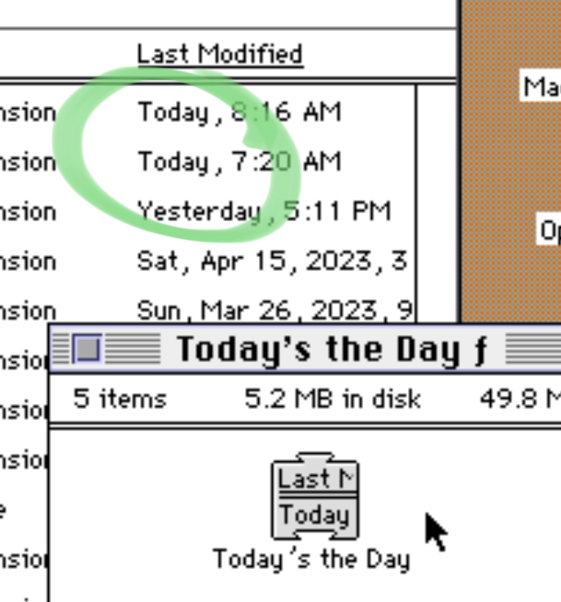

# Today's the Day

A simple vintage MacOS extension (INIT) that backports one of Mac OS 8's nicest little Finder
touches to System 6 and 7.



**[Download the built extension from Macintosh Garden →](https://macintoshgarden.org/apps/today-s-the-day)**

## What it does

Drop this in your System Folder (or Extensions folder under System 7) so
that the Finder under Systems 6/7 (and probably, I think, back much
farther than that) will show files modified today or yesterday as "Today"
or "Yesterday" — just like Mac OS 8. Works in both Finder list views and
the Get Info window.

It's quick and easy and at least a tiny bit nice. (Technical note — it
only patches `DrawString` and `DrawText` in the Finder's application heap,
so it won't slow down anything else at all.)

## Credit

Inspired by [this episode of Mac Folklore Radio](https://macfolkloreradio.com/2023/03/03/desktop-critic-mac-os-8.html),
in which Derek reads David Pogue praising Mac OS 8 in part because of this
simple feature. Now it's available in Systems 6/7!

## Localization

The two visible strings ("Today" / "Yesterday") live in STR resources #128
and #129 in the extension file. Open the built extension in ResEdit and edit those two
resources to localize it — no recompiling needed.

## Building from source

This is a Symantec C++ (THINK C) project — `TodaysTheDay.π` is the
project file, `TodaysTheDay.π.rsrc` its resource file, alongside a 
small shared utility module (`CrutchError`) I use for graceful error
handling for trap-patching INITs.

Both `.π` and `.π.rsrc` are resource-fork-only files with nothing in their
data fork, which git can't track directly — this repo uses
[`tools/mac-forks`](https://github.com/crufi/mac-forks) to capture them as
plain-text `.hqx`/`.r` sidecars instead (mac-forks requires macOS with the Xcode Command Line Tools installed (xcode-select --install), for /usr/bin/binhex, /usr/bin/DeRez, /usr/bin/Rez, /usr/bin/SetFile).

After cloning, run:

```sh
sh tools/mac-forks/install.sh
```

to materialize the real, Symantec C++-usable project and resource files. You can then drop them into an emulator's disk image
(I love `hfsutils` for this) and build with Symantec C++.
